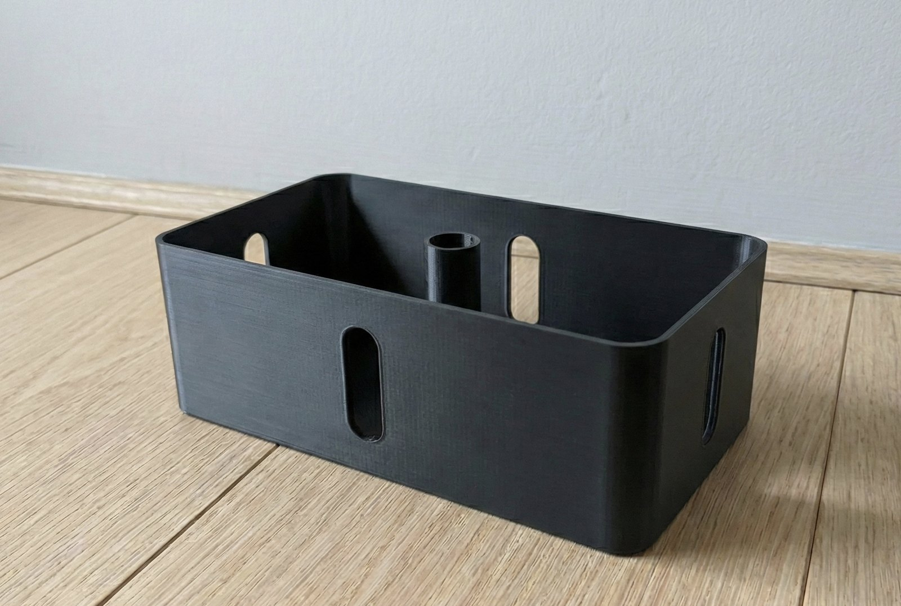
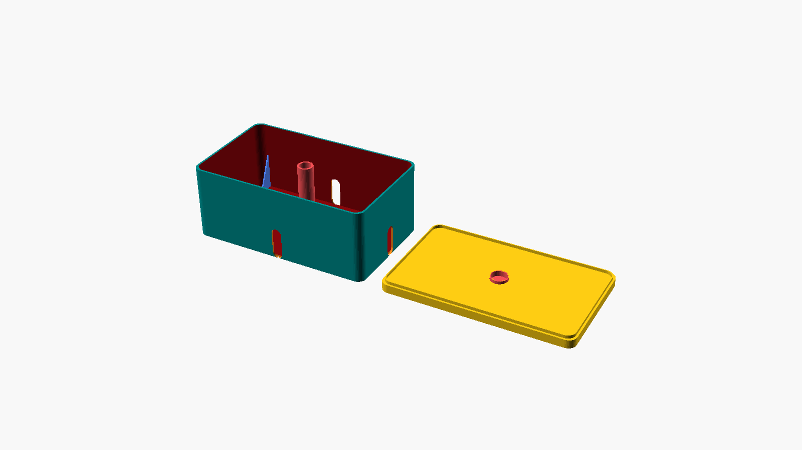
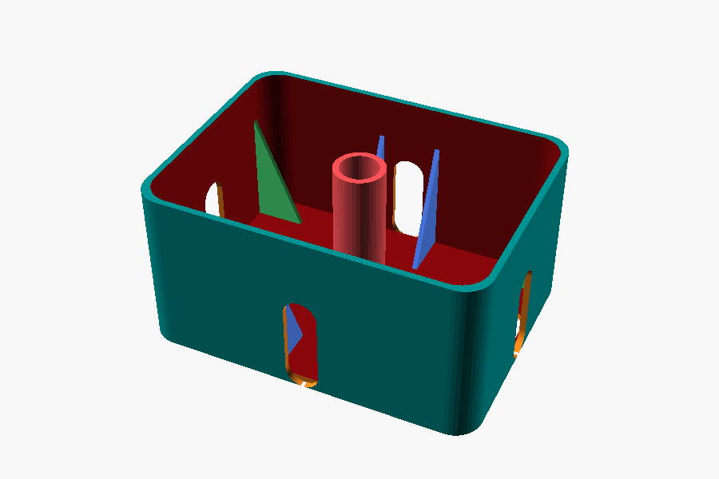
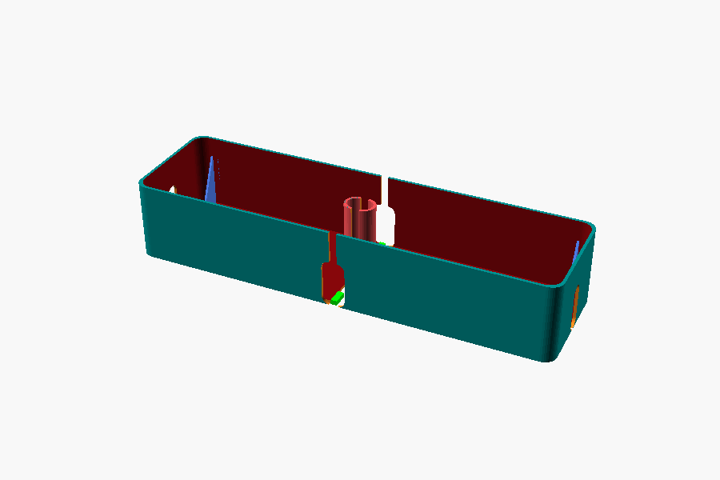
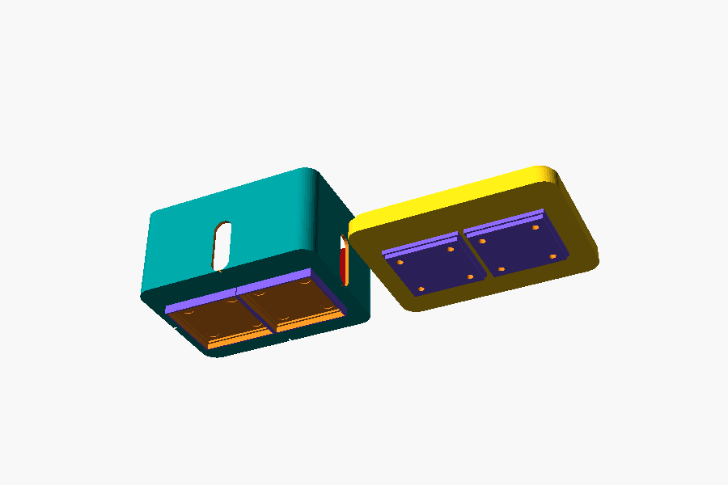

# Parametric Cable Management Box

A cable box you size to your stuff, not the other way round. Configurable
openings on every wall, an optional cable-wrapping post, interior stiffening
fins, floor cutouts, optional Gridfinity interfaces, and a slicing mode that
splits oversized boxes into pieces that clip together.



*Printed in black PETG. Openings sit flush with the floor so a cable resting on
the desk slides straight in.*

[](https://github.com/prisant-labs/3d-cable-box-parametric-openscad/actions/workflows/scad-smoke.yml)
[](https://github.com/prisant-labs/3d-cable-box-parametric-openscad/actions/workflows/docs-pages.yml)
[](LICENSE)

## Get a box

**Just want to print one?** Take an STL from
[`library/`](library/) or the
[Releases page](https://github.com/prisant-labs/3d-cable-box-parametric-openscad/releases).
Nine presets cover the common jobs, from a compact desk tidy to a six-outlet
surge strip split for a 180 mm bed. No software needed beyond your slicer.

**Want to change something?** The model needs
[BOSL2](https://github.com/BelfrySCAD/BOSL2):

```bash
# Windows and macOS
git clone https://github.com/BelfrySCAD/BOSL2.git ~/Documents/OpenSCAD/libraries/BOSL2

# Linux
git clone https://github.com/BelfrySCAD/BOSL2.git ~/.local/share/OpenSCAD/libraries/BOSL2
```

Then open `cable-box-parametric.scad` in [OpenSCAD](https://openscad.org/)
(2021.01 or newer), press <kbd>F3</kbd> for the Customizer, adjust,
<kbd>F6</kbd> to render, then export an STL.

Would rather not install anything? Every release attaches a **standalone
bundle** with BOSL2 inlined. Unzip both files into the same folder and open the
bundled `.scad`.

If you open the plain `.scad` without BOSL2 installed, the model stops with a
message telling you so, rather than rendering nothing and exiting successfully.

**Want to see what everything does first?** Open the
[visual options guide](docs/options-guide.html). Every parameter is rendered
from the model, in one self-contained file that works offline.



## What it does

| | |
|---|---|
|  | **Fins and floor cutouts.** Interior ribs stiffen long walls and automatically skip positions that would block an opening. Floor cutouts arrange along either axis and split around the centre post. |
|  | **Bigger than your printer?** Slicing mode splits the box and lid into pieces joined by tuneable snap clips, so a 265 mm box prints on a 180 mm bed. |
|  | **Gridfinity, optionally.** A 42 mm base under the box so it drops into a baseplate, a matching profile on the lid, and optional magnet and screw pockets. |

Plus: per-wall opening sizes and positions, an open or closed-bottom centre
post, adjustable lid fit, and corner radii from crisp to soft.

### Seam joints

Sliced boxes join with one of two clip styles:

- **`Tab`** (default) is a friction fit. Simple, and tuned with `Clip_Tolerance`.
- **`Snap`** is a cantilever clip with an engagement bump. The arm flexes, so it
  absorbs print inaccuracy instead of jamming, and the bump resists pull-out
  rather than relying on interference.

`Snap` is opt-in for now. Clip correctness is the one thing here that rendering
cannot check: a joint too tight to assemble passes every automated test. The
default flips once a print says it should.

### Composing with it

The box and lid are BOSL2 attachables, so accessories attach to named features
instead of computed coordinates:

```scad
Render_On_Include = false;   // or -D Render_On_Include=false
include <cable-box-parametric.scad>

m_box()
    attach("wall-back")
        my_bracket();
```

Anchors: `floor`, `rim`, `wall-front`, `wall-back`, `wall-left`, `wall-right`,
`post-top`, plus `lid-face` and `lip` on the lid. `lid-face` names the face that
ends up exposed when the box is closed, so nobody has to re-derive which side of
a face-down-printed lid is up.

## Presets

Nine ready-to-print configurations live in [`library/`](library/), each with a
complete `config.json`, STLs, renders, and notes.

| Preset | Fits | Size (mm) |
|---|---|---|
| [`usb-charger`](library/usb-charger/) | GaN multi-port charger and cables | 120 x 75 x 45 |
| [`desk-compact`](library/desk-compact/) | Short power strip, few cables | 140 x 80 x 55 |
| [`gridfinity-module`](library/gridfinity-module/) | Gridfinity 3 x 2 desk module | 140 x 100 x 60 |
| [`laptop-brick`](library/laptop-brick/) | Laptop charger plus 3 cables | 175 x 105 x 70 |
| [`under-desk-passthrough`](library/under-desk-passthrough/) | Cable junction, no post | 180 x 85 x 50 |
| [`monitor-junction`](library/monitor-junction/) | Two monitor bricks | 210 x 95 x 62 |
| [`router-shelf`](library/router-shelf/) | Router or modem plus PSU | 230 x 130 x 75 |
| [`surge-strip-6`](library/surge-strip-6/) | Six-outlet surge protector | 265 x 100 x 62 |
| [`surge-strip-6-sliced`](library/surge-strip-6-sliced/) | Same, split for a 180 mm bed | 265 x 100 x 62 |

Load one directly:

```bash
openscad -o out.stl cable-box-parametric.scad \
  -p library/desk-compact/config.json -P desk-compact
```

## Documentation

Published at
**[prisant-labs.github.io/3d-cable-box-parametric-openscad](https://prisant-labs.github.io/3d-cable-box-parametric-openscad/)**.

| Doc | What's in it |
|---|---|
| [Options guide (HTML)](docs/options-guide.html) | Every parameter, rendered. Self-contained, works offline. |
| [Options guide (Markdown)](docs/OPTIONS_GUIDE.md) | The same, readable on GitHub. |
| [Parameter reference](docs/PARAMETER_REFERENCE.md) | Exhaustive tables for every parameter. |
| [Workflows](docs/WORKFLOWS.md) | Setup, calibration, slicing, troubleshooting. |
| [Printing guide](docs/PRINTING.md) | Materials, orientation, fit calibration. |
| [FAQ](docs/FAQ.md) | Common questions and fixes. |
| [Validation rules](docs/VALIDATION_RULES.md) | Every assertion, what triggers it, how to resolve it. |
| [Module reference](docs/MODULE_REFERENCE.md) | Module-by-module geometry breakdown. |
| [Architecture](docs/SCAD_ARCHITECTURE.md) | Data flow and coordinate conventions. |
| [Parameter interactions](docs/PARAMETER_INTERACTIONS.md) | Cross-parameter behaviour. |

## A note on dimensions

`Box_Width`, `Box_Depth`, and `Box_Height` are **outer** dimensions. Usable
interior is smaller by `Wall_Thickness` on each side, and smaller again wherever
stabilizer fins sit. The model echoes the numbers at render time.

Side openings are anchored at their **bottom edge**, so `All_Openings_Up = 0`
puts the opening flush with the box bottom. That is usually what you want: a
cable lying on the desk passes straight in without climbing a lip.

## Validation

Model changes are gated by an automated geometry suite, not just a compile check.

```bash
python tests/run_tests.py          # 65 scenarios
bash scripts/scad-smoke.sh         # quick render smoke
bash scripts/check-version.sh      # version consistency
bash scripts/bump-bosl2.sh         # verified BOSL2 dependency upgrades
```

The suite asserts exit codes, assertion text, manifoldness, disconnected-solid
counts, bounding boxes, absence of warnings, and point probes against the
exported mesh. That matters more than it sounds: OpenSCAD will happily return
`0` while producing a model with a detached, unprintable piece in it, or a
correctly-sized part rotated onto the wrong axis.

The runner prints which BOSL2 version OpenSCAD actually loads before running
anything, because a local suite silently testing a different library version
than CI is a real failure mode this project has already hit.

## Contributing

Presets are the easiest useful contribution: add an entry to `PRESETS` in
`scripts/build_library.py` and rerun it. See [`CONTRIBUTING.md`](CONTRIBUTING.md),
[`CODE_OF_CONDUCT.md`](CODE_OF_CONDUCT.md), and [`SECURITY.md`](SECURITY.md).

Behaviour changes need the docs updated in the same PR, and a test scenario if
the change guards a failure mode that would otherwise exit `0`.

## Licence

[MIT](LICENSE). Print them, sell them, remix them.

Third-party components keep their own terms; see
[`THIRD_PARTY_NOTICES.md`](THIRD_PARTY_NOTICES.md). Gridfinity is by Zack
Freedman and is MIT licensed; the interface geometry here is implemented from
the published specification rather than vendored.
